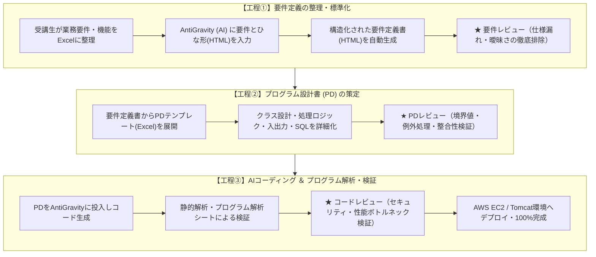

# 🎓 実践で学ぶJava+Pythonプログラマー養成講座 成果報告ポートフォリオ

> **「文法暗記」から「AI協調による設計・レビュー主導の実務開発」へ**  
> 講師として担当した「実践で学ぶJava+Pythonプログラマー養成講座」（Webプログラミング実習）において、実務未経験の初心者15名（4グループ編成）全員がAI（AntiGravity / Gemini API等）を活用し、**要件定義からプログラム完成まで各チームわずか26日間で1.7～2.8Kstep規模の**、コード検証、AWS本番デプロイまでを自走して完走・完成させた教育成果と指導プロセスの報告ポートフォリオです。

---

## 📌 研修・講座概要

| 項目 | 内容 |
| :--- | :--- |
| **講座名** | 実践で学ぶJava+Pythonプログラマー養成講座 |
| **受講対象・規模** | プログラミング初学者 〜 実務未経験者（全15名 / 4グループ編成） |
| **開発期間** | **各チーム 26日間**（要件定義着手からプログラム完成まで） |
| **達成成果** | **全4チームとも複雑な実務級システムを26日間で100%完成・AWS本番稼働達成** |
| **開発技術スタック** | Java 25 (OpenJDK), Servlet / JSP, Apache Tomcat 11, PostgreSQL 18.1, AWS (EC2) |
| **開発・設計ツール** | Eclipse, A5:SQL Mk-2, AntiGravity, Git/GitHub, 各種設計書テンプレート |
| **連携AI技術** | **機能実装**: Google Gemini API / **開発支援**: AntiGravity（PD駆動型コード生成） |

---

## 🌟 本講座における最大の成果：なぜ初心者が短期間で高品質な複雑プログラムを作れたのか

プログラミング初心者が短期間で開発を行う場合、「動くだけのスパゲッティコードになる」「初歩的な構文エラーで大半の時間を浪費する」「セキュリティ対策が抜け落ちる」という課題に直面しがちです。

本講座では、**「AI協調 × 設計書駆動（PD） × プログラム解析シート」という一貫した開発工程を導入したこと自体**が最大の成功要因となり、以下の成果を同時に達成しました。

### 1. 開発期間の大幅短縮と高い機能スコープの両立
* **タイポや構文エラーの完全排除**: 単純なコーディング作業をAI（AntiGravity）に任せることで、初心者が何日も悩みがちな「環境構築・文法・セミコロン抜け」による手戻りをゼロ化。
* **要件定義から完成までわずか26日間で高難度な機能を実現**: 避難所物資マッチングアルゴリズムや外部AI（Gemini API）連携、天候連動カレンダーなど、通常なら未経験者が数ヶ月かかる複雑なビジネスロジックを、各チームとも要件定義の着手からプログラム完成までわずか26日間で実装・結合完了。

### 2. 「動くだけ」を脱却したエンタープライズ水準の品質確保
* **解析シートに基づく客観的品質検証**: 「プログラム解析シート」を用い、AI生成コードに対する静的解析を実施。
* **セキュリティ・性能の徹底担保**: 初心者が見落としがちな「SQLインジェクション対策（PreparedStatement徹底）」「XSSサニタイズ処理」「DBコネクションリーク防止」「セッション管理」を工程内で洗い出し、設計レベルで是正。

---

## 🛠️ 指導したAI駆動開発プロセス（全3工程）

受講生が「AI任せのブラックボックス開発」に陥るのを防ぎ、**「実務で通用する設計力・品質検証力」**を身につけるため、以下の3工程からなる設計書駆動型のAI開発フローを導入・指導しました。


    ---

### 各工程の詳細と指導の工夫

#### 【工程①】要件定義の整理・HTML化
1. **要件の抽出**: 受講生自身が作りたいシステムの機能要件・非機能要件をExcelにリストアップ。
2. **AIによる構造化**: プロジェクト共通の「要件定義書ひな形（HTML）」とExcelの要件データをAI（AntiGravity）に読み込ませ、Webブラウザで閲覧可能な構造化ドキュメントを生成。
3. **要件レビュー**: 必須機能と任意機能の優先順位付け、入力バリデーション、例外フローの抜け漏れを受講生同士および講師レビューで補正。

#### 【工程②】PD（プログラム設計書）テンプレートによる詳細設計
1. **設計の標準化**: 業務クラス、サーブレット、DAO、JSP、DBテーブル定義を「PDテンプレート」に従ってExcelで記述。
2. **AI入力に耐えうる粒度の担保**:
   * メソッド名、引数、戻り値の型定義
   * 処理ロジックのステップ分割（条件分岐・ループ条件・例外処理）
   * 発行するSQL文とバインドパラメータの明記
3. **設計レビュー**: 「AIが解釈に迷う曖昧な自然言語表現」を排除し、論理的に一意な記述へブラッシュアップ。

#### 【工程③】AIコーディングとプログラム解析・品質検証
1. **AI自動生成**: 確定したPDをAntiGravityに渡し、Javaプログラム（Servlet / DAO / Model等）を生成。
2. **プログラム解析シートによる検証**:
   * AIが生成したコードの行数、複雑度、命名規則の適合性を解析シートで可視化。
   * セキュリティ上のリスク（SQLインジェクション脆弱性、APIキーの平文露出、入力サニタイズ漏れ）を点検。
   * パフォーマンス（不要なループ、DBコネクションのリーク有無）をチェック。
3. **設計書へのフィードバックループ**: コードに不備がある場合、コードを直接修正するのではなく**「PD（設計書）側の記述不備を修正してAIに再生成させる」**運用を徹底。

---

## 💡 実務未経験者が体得した「レビューの真の意義と効果」

本講座の最大の特徴は、単に「AIに作らせて終わり」にするのではなく、**実務未経験者が講師やチームメンバーからの厳格なレビューを受け、そのフィードバックを設計に還元するサイクルを徹底経験させた点**にあります。

### 1. 「AIの手戻り」を防ぐのは設計書レビューであるという実感
* **直面した課題**:  
  受講生が最初に作成した要件定義書やPDには、「主語の欠落」「処理分岐の曖昧さ」「例外時の動作未定義」が多く見られました。その状態のままAI（AntiGravity）にコード生成を依頼すると、一見動くものの想定と全く異なるロジックやセキュリティホールを含むコードが出力され、修正に膨大な時間を費やす結果となりました。
* **レビューを通じて得た学び**:  
  レビューで「この入力値が空（null）のときどう動くか」「他クラスとのデータ受け渡し仕様は明確か」を指摘され修正した結果、**「設計書の曖昧さをレビューで徹底的に排除することが、AIによる一発高品質生成と最短の開発スピードを生む」**という事実を身をもって体得しました。

### 2. 「他人とAIに誤解なく伝える言語化力」の確立
* プログラミング初学者は「動けばいい」という感覚に陥りがちですが、レビューを受ける過程で「自分しか理解できないメモ」と「AIやチームメンバーが実装できる仕様書」の決定的な違いを理解しました。
* 設計書を再集約・ブラッシュアップする中で、実務で最も重視される**「論理的なコミュニケーション能力・仕様の言語化能力」**が飛躍的に向上しました。

### 3. レビューを通じた受講生の意識変化
* **Before**: 「レビューは間違いを怒られる場」「とりあえず動くコードを書けばいい」
* **After**: **「レビューは開発の手戻りを防ぐ最大の安全網」「設計書レビューで9割の品質が決まる」**

---

## 📊 指導成果（定量・定性インパクト）

受講生15名（4グループ）全員が、誰一人脱落することなく**要件定義からプログラム完成まで26日間**という短期間で本番稼働まで達成しました。

| 評価指標 | 従来の教育カリキュラム目安 | 今回の実績（AI指導・工程導入） | 指導効果・インパクト |
| :--- | :---: | :---: | :--- |
| **開発期間** | 2〜3ヶ月以上（要件〜実装） | **各チーム 26日間（要件定義〜完成）** | 設計書駆動とAI生成で開発期間を極小化 |
| **最終成果物の完成率** | 70〜75%（未完成チームの発生） | **100%（全4チーム完成）** | 全グループが本番環境（AWS）稼働まで完走 |
| **開発到達レベル** | 基本的なCRUD処理のみ | **外部AI API連携・AWS運用** | Gemini API連携やインフラ構築まで達成 |
| **品質保証レベル** | 「動けば合格」（品質未検証） | **解析シートによる客観検証・是正** | SQLi/XSS/性能ボトルネックを排除 |
| **受講生の学習重心** | 文法暗記・タイポ修正（約70%） | **要件定義・設計・レビュー（約70%）** | より上流・本質的な開発スキルへシフト |
| **受講生の自立度** | エラーのたびに講師待ち | **AIと壁打ちして自走解決** | デバッグ・問題切り分けの自走力が定着 |

---

## 🚀 受講生グループの成果物（全4チーム完成）

実務未経験の初心者15名が独自の社会的・実生活の課題を設定し、**各チームとも要件定義からプログラム完成までわずか26日間**でAI実装・コード検証・AWSデプロイまでの全行程を完走しました。

| グループ | 開発テーマ | システム概要 | 生成ステップ数 | AI活用・技術的特徴 | 完成状況 |
| :---: | :--- | :--- | :---: | :--- | :---: |
| **Group A** | **やくそくんカレンダー** | 予定・約束管理 ＋ AI家計簿 | **2.5Kstep** | Gemini API連携 / AntiGravityによるPD駆動開発 | **AWSデプロイ完了** |
| **Group B** | **冷蔵庫コンシェルジュ** | 冷蔵庫内フードロス対策アプリ | **1.7Kstep** | AntiGravityによるPD駆動開発 | **AWSデプロイ完了** |
| **Group C** | **避難所ラストワンマイル<br>物資配送支援** | 災害発生時の救済用資材と<br>ボランティアの効果的マッチング | **2.3Kstep** | AntiGravityによるPD駆動開発 | **AWSデプロイ完了** |
| **Group D** | **家計簿アプリ** | スケジュールと家計簿をベースにした<br>活動履歴（想い出）記録システム | **2.8Kstep** | AntiGravityによるPD駆動開発 | **AWSデプロイ完了** |

※受講生の著作権およびセキュリティ保護の観点から、各成果物は概要・システム構成・技術ハイライトを中心とした構成に留めています。

---

### 代表事例：Group A「やくそくんカレンダー」
> **カレンダー（予定・約束管理）× AIアドバイス付き家計簿 Webアプリケーション**

* **システム概要**:  
  日常の予定・用事管理と、支出傾向や外部要因（天気情報等）を総合分析してパーソナライズされた節約アドバイスを自動生成するWebシステム。
* **生成プログラム規模**: 2.5Kstep
* **システム構成図**:
  ```mermaid
  graph LR
      User([ユーザー / ブラウザ]) -->|HTTP / HTTPS| WebServer["AWS EC2<br>(Apache Tomcat 11 / Java 25)"]
      WebServer -->|JDBC| DB[("PostgreSQL 18.1")]
      WebServer -->|API Request / JSON| Gemini["Google Gemini API<br>(支出分析・節約アドバイス生成)"]
  ```