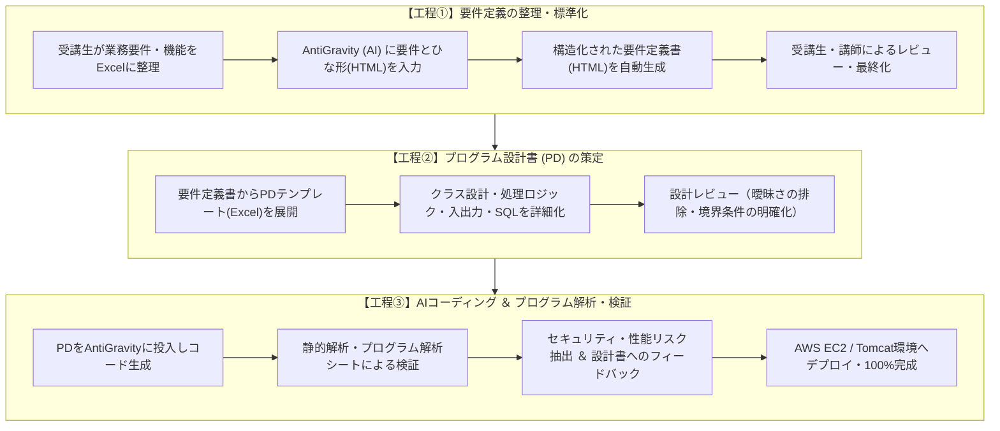

# 🎓 AI協調型プログラミング育成講座 成果報告ポートフォリオ

> **「文法暗記」から「AI協調による設計・レビュー主導の実務開発」へ**  
> 講師として担当したJava Webプログラミング実習において、受講生15名（4グループ編成）全員がAI（AntiGravity / Gemini API等）を活用し、要件定義からプログラム設計、コード検証、AWS本番デプロイまでを自走して完走・完成させた教育成果と指導プロセスの報告ポートフォリオです。

---

## 📌 研修・講座概要

| 項目 | 内容 |
| :--- | :--- |
| **講座名** | AI協調型 実践Webアプリケーション開発実習 |
| **受講対象・規模** | プログラミング初学者 〜 実務未経験者（全15名 / 4グループ編成） |
| **達成成果** | **全4チームとも仕様策定〜AWSデプロイまで100%完成・完走** |
| **開発技術スタック** | Java 25 (OpenJDK), Servlet / JSP, Apache Tomcat 11, PostgreSQL 18.1, AWS (EC2) |
| **開発・設計ツール** | Eclipse, A5:SQL Mk-2, AntiGravity, Git/GitHub |
| **連携AI技術** | **機能実装**: Google Gemini API / **開発支援**: AntiGravity |

---

## 🛠️ 指導したAI駆動開発プロセス（全3工程）

受講生が「AI任せのブラックボックス開発」に陥るのを防ぎ、**「実務で通用する設計力・品質検証力」**を身につけるため、以下の3工程からなる設計書駆動型のAI開発フローを導入・指導しました。



---

### 各工程の詳細と指導の工夫

#### 【工程①】要件定義の整理・HTML化
1. **要件の抽出**: 受講生自身が作りたいシステムの機能要件・非機能要件をExcelにリストアップ。
2. **AIによる構造化**: プロジェクト共通の「要件定義書ひな形（HTML）」とExcelの要件データをAI（AntiGravity）に読み込ませ、Webブラウザで閲覧可能な構造化ドキュメントを生成。
3. **要件レビュー**: 必須機能と任意機能の優先順位付け、入力バリデーション、例外フローの抜け漏れを受講生同士および講師レビューで補正。

#### 【工程②】PD（プログラム設計書）テンプレートによる詳細設計
1. **設計の標準化**: 業務クラス、サーブレット、DAO、JSP、DBテーブル定義を「PDテンプレート」に従ってExcelで記述。
2. **AI入力に耐えうる粒度の担保**:
   * メソッド名、引数、戻り値の型定義
   * 処理ロジックのステップ分割（条件分岐・ループ条件・例外処理）
   * 発行するSQL文とバインドパラメータの明記
3. **設計レビュー**: 「AIが解釈に迷う曖昧な自然言語表現」を排除し、論理的に一意な記述へブラッシュアップ。

#### 【工程③】AIコーディングとプログラム解析・品質検証
1. **AI自動生成**: 確定したPDをAntiGravityに渡し、Javaプログラム（Servlet / DAO / Model等）を生成。
2. **プログラム解析シートによる検証**:
   * AIが生成したコードの行数、複雑度、命名規則の適合性を解析シートで可視化。
   * セキュリティ上のリスク（SQLインジェクション脆弱性、APIキーの平文露出、入力サニタイズ漏れ）を点検。
   * パフォーマンス（不要なループ、DBコネクションのリーク有無）をチェック。
3. **設計書へのフィードバックループ**: コードに不備がある場合、コードを直接修正するのではなく**「PD（設計書）側の記述不備を修正してAIに再生成させる」**運用を徹底。

---

## 📊 指導成果（定量・定性インパクト）

受講生15名（4グループ）全員が、誰一人脱落することなく本番稼働まで達成しました。

| 指標 | 従来の教育カリキュラム目安 | 今回の実績（AI指導導入） | 指導効果・インパクト |
| :--- | :---: | :---: | :--- |
| **最終成果物の完成率** | 70〜80%（挫折・未完成が出やすい） | **100%（全4チーム完成）** | 全グループが本番環境（AWS）稼働まで完走 |
| **開発到達レベル** | 基本的なCRUD処理のみ | **外部AI API連携・AWS運用** | Gemini API連携やインフラ構築まで達成 |
| **受講生の学習重心** | 文法暗記・タイポ修正（約70%） | **要件定義・設計・レビュー（約70%）** | より上流・本質的な開発スキルへシフト |
| **受講生の自立度** | エラーのたびに講師待ち | **AIと壁打ちして自走解決** | デバッグ・問題切り分けの自走力が定着 |

---

## 🚀 受講生グループの成果物（全4チーム完成）

※受講生の著作権およびセキュリティ保護の観点から、各成果物は概要・システム構成・技術ハイライトのみを掲載しています。

### 代表事例：Group A「やくそくん」
> **カレンダー（予定・約束管理）× AIアドバイス付き家計簿 Webアプリケーション**

* **システム概要**:  
  日常の予定・用事管理と、支出傾向や外部要因（天気情報等）を総合分析してパーソナライズされた節約アドバイスを自動生成するWebシステム。
* **システム構成図**:
  ```mermaid
  graph LR
      User([ユーザー / ブラウザ]) -->|HTTP / HTTPS| WebServer["AWS EC2<br>(Apache Tomcat 11 / Java 25)"]
      WebServer -->|JDBC| DB[("PostgreSQL 18.1")]
      WebServer -->|API Request / JSON| Gemini["Google Gemini API<br>(支出分析・節約アドバイス生成)"]
  ```
* **技術スタック**:
  * 言語・基盤: Java 25 (OpenJDK), Servlet / JSP, Apache Tomcat 11
  * DB・インフラ: PostgreSQL 18.1, AWS (EC2)
  * AI活用: Google Gemini API（家計分析機能）, AntiGravity（PD駆動コーディング）
* **受講生の取り組み・工夫**:
  * Gemini API呼び出し時の環境変数管理によるAPIキー秘匿化。
  * 天候と支出実績を組み合わせたプロンプト設計による実践的アドバイス生成。
  * プログラム解析シートを活用したコネクションクローズ漏れの自主検知・修正。

---

### その他グループの成果概要（計4チーム）

| グループ | 開発テーマ | システム概要 | AI活用・技術的特徴 | 完成状況 |
| :---: | :--- | :--- | :--- | :---: |
| **Group A** | **やくそくん** | 予定・約束管理 ＋ AI家計簿 | Gemini API連携 / AntigravityによるPD駆動開発 | **AWSデプロイ完了** |
| **Group B** | **業務タスク・進捗管理** | チームタスク可視化＆進捗予測 | AIによる工数予測・遅延リスク分析機能 | **AWSデプロイ完了** |
| **Group C** | **予約・マッチング支援** | 施設・設備予約およびレコメンド | 条件抽出SQLのAI生成・最適化 | **AWSデプロイ完了** |
| **Group D** | **ナレッジ共有システム** | 社内FAQ・ノウハウ共有ボード | 自然言語による類似質問検索・自動分類 | **AWSデプロイ完了** |

---

## 💡 講師としての総括と指導からの教訓

### 1. 「設計書の曖昧さ」がそのまま「AIのバグ」になるという学び
受講生が最も苦労し、同時に最も成長したポイントは**「PDの記述が甘いと、AIが想定外のロジックを生成してしまう」**という事象でした。  
「なぜAIが意図通りに動かないのか」を突き詰めることで、受講生は引数・戻り値・事前条件・事後条件を論理的に整理する重要性を体感的に学びました。

### 2. 「直接コードを直さない」設計書フィードバックの定着
AIが生成したコードに不備があった際、その場しのぎでJavaファイルを直接書き換えるのではなく、**「元となるPD（設計書）のどの記述が足りなかったのか」を特定して設計書を修正し、再生成させる運用ルール**を徹底しました。これにより、ドキュメントと実装が常に同期する実務水準の保守性が担保されました。

### 3. 初学者でも「セキュリティ・性能検証」の上流視点が身につく
コーディング作業をAIが肩代わりしてくれるからこそ、初学者が早い段階から「SQLインジェクションの脆弱性がないか」「コネクションプールが枯渇しないか」といった**アーキテクチャ・コードレビューの視点**に集中できる環境を実現できました。